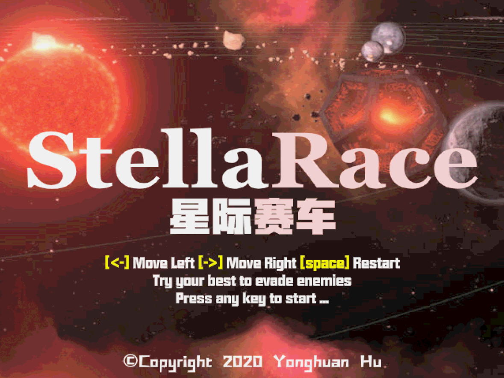
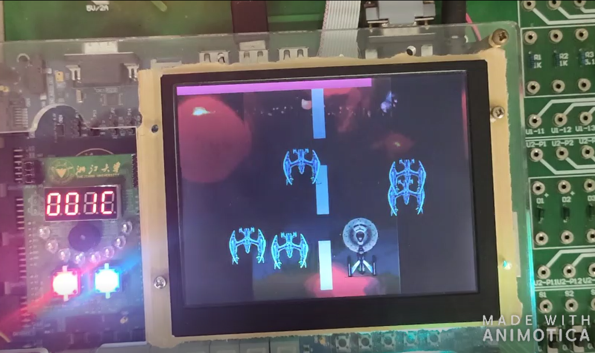

# StellaRace
A Raiden-like arcade videogame for Xilinx 7 series FPGA devices, wrote in Verilog HDL.

Pilot your starship and evade your hostiles.

Download the .bit file in `/executable` and deploy it on your Xilinx device using Xilinx iMPACT, and play!

